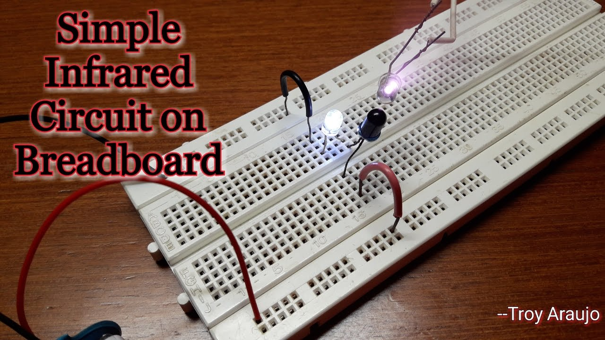
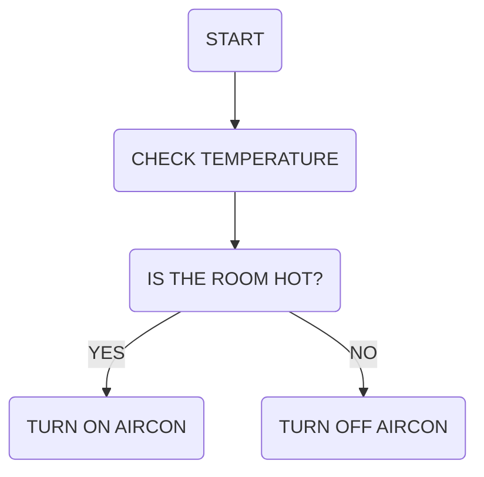
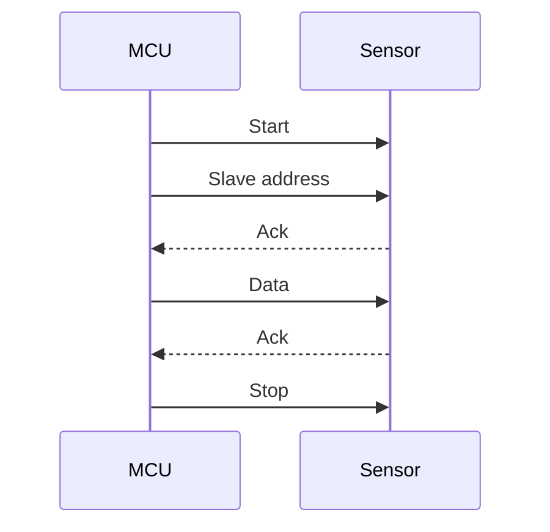

# Pine

>A simple infrared controller

   

<!-- @import "[TOC]" {cmd="toc" depthFrom=1 depthTo=6 orderedList=false} -->

<!-- code_chunk_output -->

- [Pine](#pine)
  - [Components](#components)
    - [Input voltages](#input-voltages)
      - [Flow chart](#flow-chart)
        - [Wavelength equation](#wavelength-equation)
          - [Infrared range test](#infrared-range-test)
      - [I2C Protocol](#i2c-protocol)
  - [I2C Timing diagram](#i2c-timing-diagram)

<!-- /code_chunk_output -->


## Components

- Microcontroller **ATMSAMD21G**
- IR RED emitter *940nm*
- IR Receiver 
- Temperature / Humidity sensor 

### Input voltages

| Components | Voltages 
|------------|---------|
| Mcu | `1.63v` to `3.42v`|
| Sensor | `1.9v` to `3.6v`|

#### Flow chart



##### Wavelength equation

$$\lambda = \frac {v}{f}$$

###### Infrared range test


```vega-lite 
{
  "data": {
    "values": [
      {"resistance(ohm)": 10, "distance(cm)": 5},
      {"resistance(ohm)": 20, "distance(cm)": 15},
      {"resistance(ohm)": 30, "distance(cm)": 25}
    ]
  },
  "mark": "line",
  "encoding": {
    "x": {"field": "resistance(ohm)", "type": "quantitative"},
    "y": {"field": "distance(cm)", "type": "quantitative"}
  }
}
```   

#### I2C Protocol



## I2C Timing diagram

```wavedrom
{signal: [
   {
       name: 'SCL',
       wave: '1.010101010101'
   },
   {
      name: 'SDA',
      wave: '103.4.5.6.7.8,01',
      data: ['D6','D5','D4','D0','R/W','ACK']
   }
]}
```


