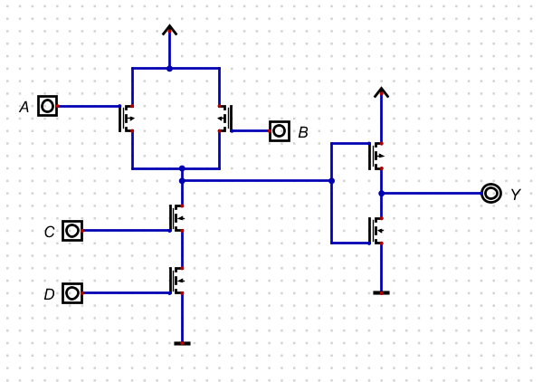
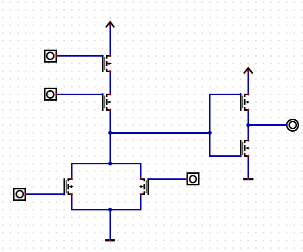
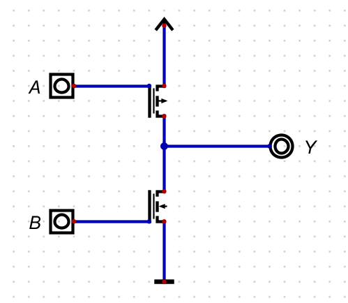
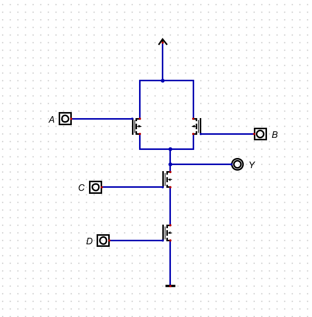
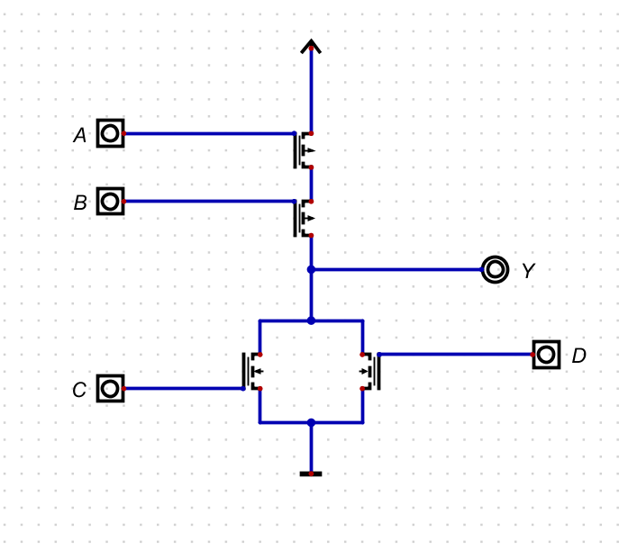
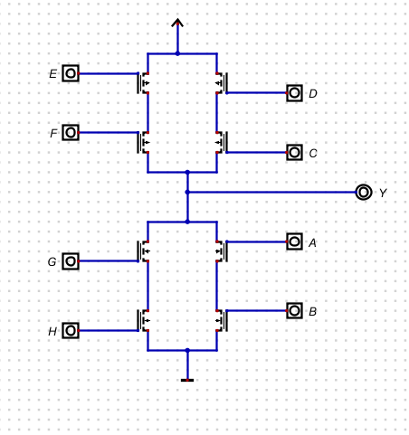
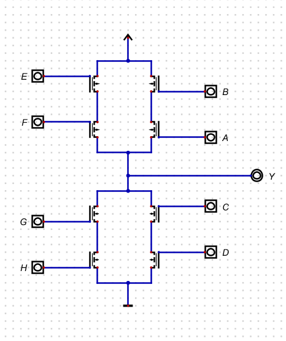

# LOGIC GATES
_________________________________________________

>>BASIC GATES 

1. AND GATE - 
 
   ##### Truth table 

| A (Input) | B (Input) | Y = A · B (Output) |
| --------- | --------- | ------------------ |
| 0         | 0         | 0                  |
| 0         | 1         | 0                  |
| 1         | 0         | 0                  |
| 1         | 1         | 1                  |

    ##### AND Gate using CMOS Technology

2. OR GATE - 
    
     ##### Truth table

| A (Input) | B (Input) | Y = A + B (Output) |
| --------- | --------- | ------------------ |
| 0         | 0         | 0                  |
| 0         | 1         | 1                  |
| 1         | 0         | 1                  |
| 1         | 1         | 1                  |

##### OR Gate using CMOS Technology

3. NOT GATE - 
 
   ##### Truth table 

| A (Input) | Y = ¬A (Output) |
| --------- | --------------- |
| 0         | 1               |
| 1         | 0               |

   ##### NOT Gate using CMOS Technology

>>SPECIAL GATES

1. NAND GATE - 
   
   ##### Truth table 

| A (Input) | B (Input) | Y = ¬(A · B) (Output) |
| --------- | --------- | --------------------- |
| 0         | 0         | 1                     |
| 0         | 1         | 1                     |
| 1         | 0         | 1                     |
| 1         | 1         | 0                     |

  ##### NAND Gate using CMOS Technology

  

  2. NOR GATE - 
   
     ##### Truth table 

| A (Input) | B (Input) | Y = ¬(A + B) (Output) |
| --------- | --------- | --------------------- |
| 0         | 0         | 1                     |
| 0         | 1         | 0                     |
| 1         | 0         | 0                     |
| 1         | 1         | 0                     |

   ##### NOR Gate using CMOS Technology 

>>EXCLUSIVE GATES

1. XOR GATE - 
  
   ##### Truth table 

| A (Input) | B (Input) | Y = A ⊕ B (Output)|
| --------- | --------- | ------------------ |
| 0         | 0         | 0                  |
| 0         | 1         | 1                  |
| 1         | 0         | 1                  |
| 1         | 1         | 0                  |

  ##### XOR Gate using CMOS Technology 

  

  2. XNOR GATE -
   
##### Truth table 

| A (Input) | B (Input) | Y = ¬(A ⊕ B) (Output)|
| --------- | --------- | --------------------- |
| 0         | 0         | 1                     |
| 0         | 1         | 0                     |
| 1         | 0         | 0                     |
| 1         | 1         | 1                     |

 ##### XNOR Gate using CMOS Technology 

 

 
