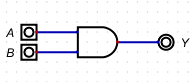
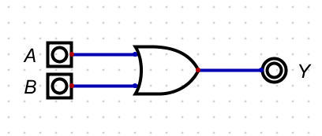
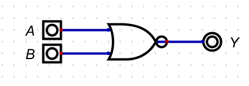
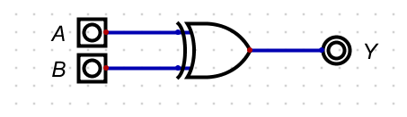
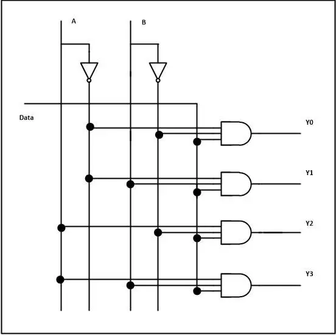
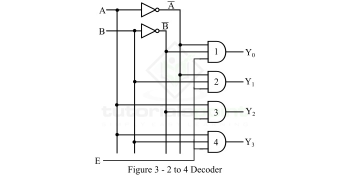

# VLSI 
--------------------------------------------

## LOGIC GATES

> Basic Logic Gates 
 
    These are the fundamental gates used in digital circuits:
1. **AND Gate** -

    Output is 1 only when all inputs are 1.



  ##### Truth table

| A | B |    Y    |
|---|---|---------|
| 0 | 0 |    0    |
| 0 | 1 |    0    |
| 1 | 0 |    0    |
| 1 | 1 |    1    |

 ##### Timing diagram

```wavedrom
{ "signal": [
  { "name": "A", "wave": "01.100110" },
  { "name": "B", "wave": "00.110011" },
  { "name": "Y", "wave": "00.100010" }
]}
```

##### AND Gate using CMOS Technology


2. **OR Gate** -
    
    Output is 1 when at least one input is 1.
    

##### Truth table 

| A | B | Y |
|---|---|---|
| 0 | 0 | 0 |
| 0 | 1 | 1 |
| 1 | 0 | 1 |
| 1 | 1 | 1 |

##### Timing diagram 

```wavedrom
{"signal": [
    {
        "name": "A",
        "wave": "10.001101"
    },
    {
        "name": "B",
        "wave": "10.101010"
    },
    {
        "name": "C",
        "wave": "10.101111"
    }
]}
```

##### OR Gate using CMOS Technology


3. **NOT Gate** -

   It inverts the input: 0 becomes 1, and 1 becomes 0.

   

##### Truth table

| A | Y |
|---|---|
| 0 | 1 |
| 1 | 0 |

##### Timing diagram

```wavedrom
{ "signal": [
  { "name": "A", "wave": "01010101" },
  { "name": "Y",    "wave": "10101010" }
]}
```
##### NOT Gate using CMOS Technology


>Universal Logic Gates

     These gates can be used to create any other logic gate:

1. **NAND Gate** - 
    
    Output is 0 only when all inputs are 1.

    

##### Truth table 

| A | B |  Y |
|---|---|----|
| 0 | 0 | 1  |       
| 0 | 1 | 1  |       
| 1 | 0 | 1  |  
| 1 | 1 | 0  |    

##### Timing diagram

```wavedrom
{ "signal": [
  { "name": "A",   "wave": "01011010" },
  { "name": "B",   "wave": "01100110" },
  { "name": "Y ", "wave": "11101001" }
]}
```

##### NAND Gate using CMOS Technology


2. **NOR Gate** -

    Output is 1 only when all inputs are 0.
    

##### Truth table

| A | B | Y |
|---|---|---|
| 0 | 0 | 1 |
| 0 | 1 | 0 |
| 1 | 0 | 0 |
| 1 | 1 | 0 |

##### Timing diagram

```wavedrom
{ "signal": [
  { "name": "A", "wave": "01011010" },
  { "name": "B", "wave": "01100110" },
  { "name": "Y", "wave": "10000001" }
]}
```

##### NOR Gate using CMOS Technology 


>Exclusive Logic Gates
  
     These gates can be used to create any other logic gates:

1. **XOR Gate** - 
   
   Output is 1 if inputs are different.
   

##### Truth table 


| A | B | Y |
|---|---|---|
| 0 | 0 | 0 |
| 0 | 1 | 1 |
| 1 | 0 | 1 |
| 1 | 1 | 0 |

##### Timing diagram 

```wavedrom
{ "signal": [
  { "name": "A", "wave": "01011010" },
  { "name": "B", "wave": "01100110" },
  { "name": "Y", "wave": "00111101" }
]}
```

##### XOR Gate using CMOS Technology


2. **XNOR Gate** -
   
   Output is 1 if inputs are the same.
   

##### Truth table

| A | B | Y |
|---|---|---|
| 0 | 0 | 1 |
| 0 | 1 | 0 |
| 1 | 0 | 0 |
| 1 | 1 | 1 |

##### Timing diagram 

```wavedrom
{ "signal": [
  { "name": "A", "wave": "01011010" },
  { "name": "B", "wave": "01100110" },
  { "name": "Y", "wave": "11000010" }
]}
```

##### XNOR Gate using CMOS Technology


## FLIPFLOPS

Flip-flops are basic sequential logic circuits used in digital electronics to store binary data (0 or 1). They are the building blocks of memory elements, registers, counters, and many other digital systems.

 >Types of Flip-Flops:

1. **SR Flip-Flop** -
   

   

   ##### Truth table 

| **S** | **R** | **Q** | **Q̅**  | Meaning          |
| ----- | ----- | ----- | ------ | ---------------- |
| 0     | 0     | Same  | Same   | Hold (No change) |
| 0     | 1     | 0     | 1      | Reset            |
| 1     | 0     | 1     | 0      | Set              |
| 1     | 1     | -     | -      | Invalid          |


##### Characteristic table

| S | R | Qn | Q n+1 |
|---|---|----|-------|
| 0 | 0 | 0  |  0    |
| 0 | 0 | 1  |  1    |
| 0 | 1 | 0  |  0    |
| 0 | 1 | 1  |  0    |
| 1 | 0 | 0  |  1    |
| 1 | 0 | 1  |  1    |
| 1 | 1 | 0  |  -    |
| 1 | 1 | 1  |  -    |

##### SR K-MAP 


##### EQUATION

Qn+1 = $ S + R\bar (Qn) $
PDN = $(Qn+1\bar)$ = $(s\bar)(R + Qn\bar)$

##### SR FLIPFLOP using CMOS Technology


2. **JK Flip-Flop** - 
   

   

##### Truth table 

| **J** | **K** | **Q**  | **Q̅**  |
| ----- | ----- | ------ | ------ |
| 0     | 0     | Same   | Same   |
| 0     | 1     | 0      | 1      |
| 1     | 0     | 1      | 0      |
| 1     | 1     | Toggle | Toggle |


##### Characteristic table 


| J | K | Qn | Q n+1 |
|---|---|----|-------|
| 0 | 0 | 0  |  0    |
| 0 | 0 | 1  |  1    |
| 0 | 1 | 0  |  0    |
| 0 | 1 | 1  |  0    |
| 1 | 0 | 0  |  1    |
| 1 | 0 | 1  |  1    |
| 1 | 1 | 0  |  1    |
| 1 | 1 | 1  |  0    |

##### JK K-MAP


##### EQUATION

Qn+1 = $(k\bar)Qn + J(Qn\bar)$
PDN = $(Qn+1\bar)$ = $(K+Qn\bar)(J\bar+Qn)$

###### JK FLIPFLOP using CMOS Technology


3. **D Flip-Flop** -
  

  

  ##### Truth table 

| CLK | D | Q (Next State) | Q̅         |
| --- | - | -------------- | --------- |
| 0   | X | No Change      | No Change |
| ↑   | 0 | 0              | 1         |
| ↑   | 1 | 1              | 0         |


##### Characteristic table 


| D | Qn | Q n+1 |
|---|----|-------|
| 0 | 0  |  0    |
| 0 | 1  |  0    |
| 1 | 0  |  1    |
| 1 | 1  |  1    |


##### D K-MAP


##### EQUATION 

Qn+1 = D
PDN = $(D\bar)$

##### D FLIPFLOP using CMOS Technology


4. **T Flip-Flop** - 
    
    

  ##### Truth table

| T (Input) | Q (Next State) | Operation      |
| --------- | -------------- | -------------- |
| 0         | Q (No change)  | Hold           |
| 1         | Q̅ (Toggle)     | Toggle/Q flips |


##### Characteristic table 


| T | Qn | Q n+1 |
|---|----|-------|
| 0 | 0  |  0    |
| 0 | 1  |  1    |
| 1 | 0  |  1    |
| 1 | 1  |  0    |


##### T  K-MAP


##### EQUATION 

Qn+1 = $T(Qn\bar)+(T\bar)Qn$

PDN = $(T\bar + Qn)(T + Qn\bar)$


##### T FLIPFLOP using CMOS Technology


## MULTIPLEXERS 

A multiplexer (MUX) is a combinational circuit that selects one of many input signals and forwards it to a single output line. It uses selection lines to choose which input to pass through.


>TYPES OF MULTIPLEXERS 

1. **2-to-1 MUX** -

    


##### Truth table 

| S | Y (Output) |
| - | ---------- |
| 0 | I0         |
| 1 | I1         |


##### EQUATION

Y=$(S\bar)⋅I0+S⋅I1$

##### 2 TO 1 MUXS using CMOS Technology


2. **4-to-1 MUX** - 
   
   

##### Truth table 

| S1 | S0 | Y (Output) |
| -- | -- | ---------- |
| 0  | 0  | I0         |
| 0  | 1  | I1         |
| 1  | 0  | I2         |
| 1  | 1  | I3         |

##### EQUATION 

Y=S1′S0′⋅I0 + S1′S0⋅I1 + S1.S0′⋅I2 + S1S0⋅I3

##### 4 TO 1 MUXS using CMOS Technology


## DEMULTIPLEXERS 

A DEMUX (Demultiplexer) is a combinational logic circuit that takes a single input and channels it to one of several outputs based on the values of select lines.

1. **1 TO 2 DEMUX** -


##### Truth table

| **Input (D)** | **Select (S)** | **I₀** | **I₁** |
| ------------- | -------------- | ------ | ------ |
| 0             | 0              | 0      | 0      |
| 1             | 0              | 1      | 0      |
| 1             | 1              | 0      | 1      |

##### EQUATION

I₀ = D · $(S\bar)$

I₁ = D · S

##### 1 TO 2 DEMUX using CMOS Technology 


2. **1 TO 4 DEMUX** - 



##### Truth table 

| **D** | **S₁** | **S₀** | **Y₀** | **Y₁** | **Y₂** | **Y₃** |
| ----- | ------ | ------ | ------ | ------ | ------ | ------ |
| 0     | x      | x      | 0      | 0      | 0      | 0      |
| 1     | 0      | 0      | 1      | 0      | 0      | 0      |
| 1     | 0      | 1      | 0      | 1      | 0      | 0      |
| 1     | 1      | 0      | 0      | 0      | 1      | 0      |
| 1     | 1      | 1      | 0      | 0      | 0      | 1      |


##### EQUATION 

Y₀ = D · $(S₁\bar)$·$(S₀\bar)$

Y₁ = D · $(S₁\bar)$· S₀

Y₂ = D · S₁ · $(S₀\bar)$

Y₃ = D · S₁ · S₀


##### 1 TO 4 DEMUX using CMOS Technology 


## ENCODERS

An encoder is a combinational circuit that converts 2ⁿ input lines into an n-bit output code. It performs the reverse function of a decoder.

1. **4-to-2 Encoder** - 

      

   ##### Truth table

   | D0 | D1 | D2 | D3 | Y0 | Y1 |
   |----|----|----|----|----|----|
   | 1  | 0  | 0  | 0  | 0  | 0  |
   | 0  | 1  | 0  | 0  | 0  | 1  |
   | 0  | 0  | 1  | 0  | 1  | 0  |
   | 0  | 0  | 0  | 1  | 1  | 1  |

   ##### EQUATION 

   Y0 = D1 + D3 
   PDN = $(Y0\bar)$ = $(D1\bar)(D3\bar)$

   Y1 = D2 + D3 
   PDN = $(Y1\bar)$ = $(D2\bar)(D3\bar)$
 
  ##### 4 TO 2 ENCODER using CMOS Technology 

  

2. **8-to-3 Encoder** - 
    
    

    ##### Truth table 


| D₇ | D₆ | D₅ | D₄ | D₃ | D₂ | D₁ | D₀ | Y₂ | Y₁ | Y₀ |
| -- | -- | -- | -- | -- | -- | -- | -- | -- | -- | -- |
| 0  | 0  | 0  | 0  | 0  | 0  | 0  | 1  | 0  | 0  | 0  |
| 0  | 0  | 0  | 0  | 0  | 0  | 1  | 0  | 0  | 0  | 1  |
| 0  | 0  | 0  | 0  | 0  | 1  | 0  | 0  | 0  | 1  | 0  |
| 0  | 0  | 0  | 0  | 1  | 0  | 0  | 0  | 0  | 1  | 1  |
| 0  | 0  | 0  | 1  | 0  | 0  | 0  | 0  | 1  | 0  | 0  |
| 0  | 0  | 1  | 0  | 0  | 0  | 0  | 0  | 1  | 0  | 1  |
| 0  | 1  | 0  | 0  | 0  | 0  | 0  | 0  | 1  | 1  | 0  |
| 1  | 0  | 0  | 0  | 0  | 0  | 0  | 0  | 1  | 1  | 1  |


##### EQUATION 

Y0 = D1 + D3 + D5 + D7
PDN = $(Y0\bar)$ = $(D1\bar)(D3\bar)(D5\bar)(D7\bar)$

Y1 = D2 + D3 + D6 + D7
PDN = $(Y1\bar)$ = $(D2\bar)(D3\bar)(D6\bar)(D7\bar)$

Y2 = D4 + D5 + D6 + D7
PDN = $(Y2\bar)$ = $(D4\bar)(D5\bar)(D6\bar)(D7\bar)$


##### 8 TO 3 ENCODER using CMOS Technology


## DECODERS
A decoder is a combinational logic circuit that converts binary information from n input lines to a maximum of 2ⁿ unique output lines.

1. **2 TO 4 Decoder** - 
   


##### Truth table 

| **E (Enable)** | **A** | **B** | **D₀** | **D₁** | **D₂** | **D₃** |
| -------------- | ------ | ------ | ------ | ------ | ------ | ------ |
| 0              | X      | X      | 0      | 0      | 0      | 0      |
| 1              | 0      | 0      | 1      | 0      | 0      | 0      |
| 1              | 0      | 1      | 0      | 1      | 0      | 0      |
| 1              | 1      | 0      | 0      | 0      | 1      | 0      |
| 1              | 1      | 1      | 0      | 0      | 0      | 1      |


##### EQUATION 

Y0 = E.A'.B'
PDN = E'.A.B

Y1 = E.A'.B
PDN = E'.A.B'

Y2 = E.A.B'
PDN = E'.A'.B

Y3 = E.A.B
PDN = E'.A'.B'


##### 2 TO 4 DECODER using CMOS Technology 


## ALU 

An ALU (Arithmetic Logic Unit) is a digital circuit used in computers and other digital systems to perform arithmetic and logical operations.

##### ALU using CMOS Technology 


## MOVE INSTRUCTION 

Moving data from one register to another.Transferring data from memory to a register.Loading an immediate value.

##### USING CMOS TECHNOLOGY


​
 
​
