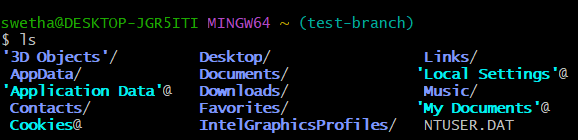
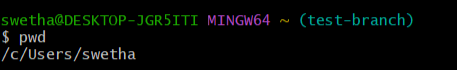
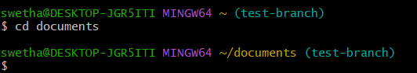
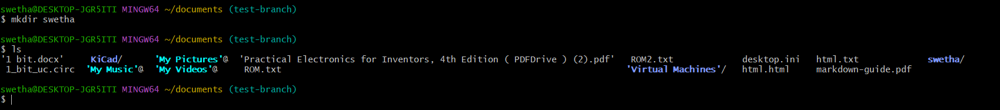
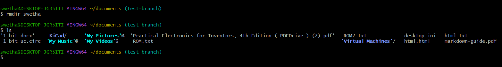
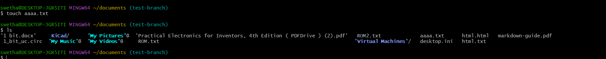
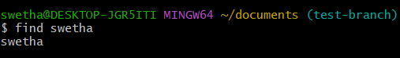
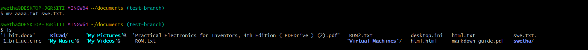

# Linux Commands

1. File & Directory Management - 

    ls - list files and directories
    

    pwd - show current directory

    

   cd - change directory
   

   mkdir - create new directory
   

   rmdir - remove empty directory
   
   
   touch - create empty file
   

   find - search for files and directories
   

   mv - move or remove files
   

2. Viewing and Editing Files -

    cat - view file contents 

   
