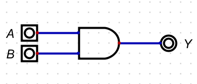
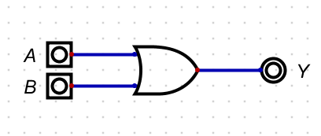
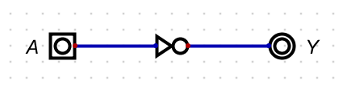
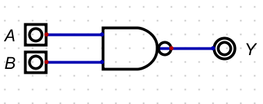
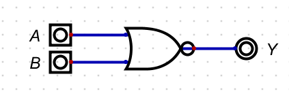
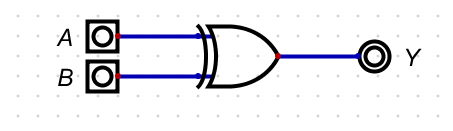
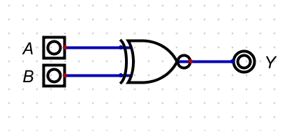

# LOGIC GATES

> Basic Logic Gates 
 
    These are the fundamental gates used in digital circuits:
1. AND Gate -

    Output is 1 only when all inputs are 1.



  ##### Truth table

| A | B |    Y    |
|---|---|---------|
| 0 | 0 |    0    |
| 0 | 1 |    0    |
| 1 | 0 |    0    |
| 1 | 1 |    1    |

 ##### Timing diagram

```wavedrom
{ "signal": [
  { "name": "A", "wave": "01.100110" },
  { "name": "B", "wave": "00.110011" },
  { "name": "Y", "wave": "00.100010" }
]}
```


2. OR Gate -
    
    Output is 1 when at least one input is 1.
    

##### Truth table 

| A | B | Y |
|---|---|---|
| 0 | 0 | 0 |
| 0 | 1 | 1 |
| 1 | 0 | 1 |
| 1 | 1 | 1 |

##### Timing diagram 

```wavedrom
{"signal": [
    {
        "name": "A",
        "wave": "10.001101"
    },
    {
        "name": "B",
        "wave": "10.101010"
    },
    {
        "name": "C",
        "wave": "10.101111"
    }
]}
```

3. NOT Gate -

   It inverts the input: 0 becomes 1, and 1 becomes 0.

   

##### Truth table

| A | Y |
|---|---|
| 0 | 1 |
| 1 | 0 |

##### Timing diagram

```wavedrom
{ "signal": [
  { "name": "A", "wave": "01010101" },
  { "name": "Y",    "wave": "10101010" }
]}
```

>Universal Logic Gates

     These gates can be used to create any other logic gate:

1. NAND Gate - 
    
    Output is 0 only when all inputs are 1.

    

##### Truth table 

| A | B |  Y |
|---|---|----|
| 0 | 0 | 1  |       
| 0 | 1 | 1  |       
| 1 | 0 | 1  |  
| 1 | 1 | 0  |    

##### Timing diagram

```wavedrom
{ "signal": [
  { "name": "A",   "wave": "01011010" },
  { "name": "B",   "wave": "01100110" },
  { "name": "Y ", "wave": "11101001" }
]}
```

2. NOR Gate -

    Output is 1 only when all inputs are 0.
    

##### Truth table

| A | B | Y |
|---|---|---|
| 0 | 0 | 1 |
| 0 | 1 | 0 |
| 1 | 0 | 0 |
| 1 | 1 | 0 |

##### Timing diagram

```wavedrom
{ "signal": [
  { "name": "A", "wave": "01011010" },
  { "name": "B", "wave": "01100110" },
  { "name": "Y", "wave": "10000001" }
]}
```

>Exclusive Logic Gates
  
     These gates can be used to create any other logic gates:

1. XOR Gate - 
   
   Output is 1 if inputs are different.
   

##### Truth table 


| A | B | Y |
|---|---|---|
| 0 | 0 | 0 |
| 0 | 1 | 1 |
| 1 | 0 | 1 |
| 1 | 1 | 0 |

##### Timing diagram 

```wavedrom
{ "signal": [
  { "name": "A", "wave": "01011010" },
  { "name": "B", "wave": "01100110" },
  { "name": "Y", "wave": "00111101" }
]}
```

2. XNOR Gate -
   
   Output is 1 if inputs are the same.
   

##### Truth table

| A | B | Y |
|---|---|---|
| 0 | 0 | 1 |
| 0 | 1 | 0 |
| 1 | 0 | 0 |
| 1 | 1 | 1 |

##### Timing diagram 

```wavedrom
{ "signal": [
  { "name": "A", "wave": "01011010" },
  { "name": "B", "wave": "01100110" },
  { "name": "Y", "wave": "11000010" }
]}
```


  


